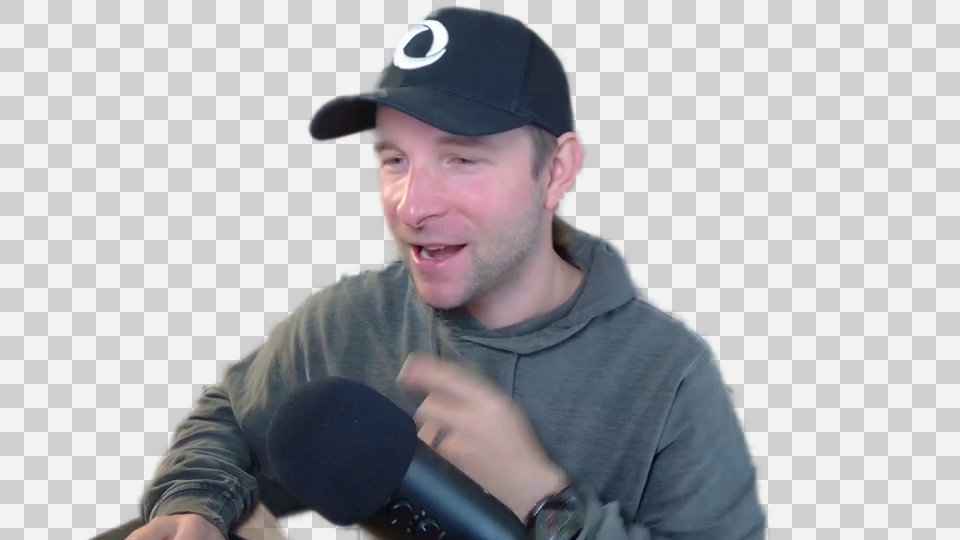

#  video-cutout

Cut the background out of a talking-head video and get a transparent .mov

Windows

<!-- media: hero -->
<!--  -->
<!-- /media: hero -->

## What it is

This takes a video of me talking and removes the background, writing out a transparent ProRes 4444 .mov that I can drop over a screen recording in DaVinci Resolve.

By default it uses RobustVideoMatting on the GPU, which is made for video of people. The output keeps the full frame size of the source, so it lines up nicely when you place it in Resolve.

Previously called `remove-portrait`.

## Get it

Paste this into your AI coding agent (Claude Code, Codex, Cursor...):

> Clone https://github.com/mikecann/video-cutout and make it my own. It's one of Mike
> Cann's personal tools, so read the README first, change anything specific to his
> setup to suit mine, then help me get it running.

### Or set it up by hand

You'll need Windows, Git, Python 3.10 or newer on PATH, and FFmpeg in
`C:\dev\tools` or on PATH. The default RVM backend also needs an NVIDIA GPU,
working CUDA drivers and a CUDA-enabled PyTorch installation.

```powershell
git clone https://github.com/mikecann/video-cutout.git
cd video-cutout
powershell -ExecutionPolicy Bypass -File .\install.ps1
```

The installer writes command launchers to `C:\dev\tools`, converts the icon,
adds the Explorer entries and runs `deps.ps1`. That script creates `.venv` in
this clone, installs the Python dependencies and downloads RVM source and
weights when missing. No API keys or `.env` file are needed.

Add `C:\dev\tools` to your User PATH if the installer says it is missing, then
open a new terminal. You can change the launcher directory with `-ToolsDir`.

If you already have the dependencies, use `install.ps1 -SkipDeps`. You can also
run `powershell -ExecutionPolicy Bypass -File .\deps.ps1` directly. Keep the
clone where it is after installing; the launchers point to it. If you move it,
run the installer again.

## Using it

From a terminal:

```powershell
video-cutout C:\videos\clip.mkv
```

Or right-click a video in File Explorer and choose **Mike's Tools > Video Cutout**.
On Windows 11, you may need **Show more options** first.

The result is saved beside the input as `clip_cutout.mov`, at the source frame
size. Existing output files are kept and the next file gets a number, such as
`clip_cutout_2.mov`. Use `-o C:\videos\overlay.mov` to choose an output path.
An explicitly chosen output path can be overwritten.



## Tuning

For quick tests:

```powershell
video-cutout C:\videos\clip.mkv --sample-seconds 3 --max-width 960
video-cutout C:\videos\clip.mkv --backend rembg --sample-seconds 3 --preview --max-width 960
```

Useful options:

```text
--backend rvm            default; faster video-native CUDA backend
--backend rembg          older frame-by-frame image segmentation backend
--codec prores           default; high-quality ProRes 4444 alpha
--codec qtrle            huge QuickTime Animation alpha output
--max-width 960          faster preview/output width; default is source size
--rvm-downsample-ratio 0.125
--rvm-chunk 4
--model u2net_human_seg  default model for the rembg backend
--model isnet-general-use
--model birefnet-portrait
--shrink 1               shrink the matte edge by N pixels
--blur 1                 soften the matte edge
--alpha-matting          slower edge solver; useful for awkward clips
--preview                rembg backend only; also write a checkerboard MP4 preview
--no-audio               do not copy source audio into the MOV
```

## Settings and output

- Output uses ProRes 4444 with alpha because Resolve imports it reliably and it
  is much smaller than QuickTime Animation (`qtrle`). The default ProRes encode
  uses `-qscale:v 12 -alpha_bits 8`.
- RVM files live in `C:\dev\tools\_models\video-cutout`, created by
  `deps.ps1`. Existing downloads in the previous cache are reused as a fallback.
  Model/source files are kept out of the repo.
- The `rembg` backend can use `onnxruntime-gpu`; RVM uses PyTorch CUDA.
- The source video has no alpha channel, so the output must be encoded into a
  new alpha-capable format. ProRes 4444 is the default because it is
  Resolve-friendly and far smaller than `qtrle`.
- Source-size 4K segmentation is slow on CPU. Use `--max-width 960` for tuning
  runs, then run without it for the final Resolve overlay.
- The `rembg` fallback may download model weights into `%USERPROFILE%\.u2net`.
- Full-frame output is intentional. Crop-to-subject was avoided because moving
  around the camera frame would make positioning harder in Resolve.

The rembg fallback currently writes `qtrle` even if `--codec prores` is selected.
Use the default RVM backend for ProRes output.

See [docs/spike-results.md](docs/spike-results.md) for the backend/codec tests
that led to the current defaults.

## Troubleshooting

- If RVM reports that CUDA is unavailable, check the PyTorch installation in
  `.venv` and your NVIDIA drivers. `deps.ps1` prints CUDA status. Installing
  `torch` alone does not guarantee that you have a CUDA-enabled build.
- If FFmpeg is missing, put `ffmpeg.exe` in `C:\dev\tools`, beside the Python
  script, or on PATH. Generated launchers pass their directory through `EXEDIR`.
- If you do not have a CUDA GPU, try `--backend rembg`. CPU processing can be
  slow, so start with a short sample and a smaller `--max-width`.
- `--preview` is supported by rembg only. RVM prints a warning for this flag.
- Models and RVM source have their own upstream licences. The MIT licence here
  covers this tool's code.

## Development

The unit tests use Pillow and do not load inference runtimes or download models:

```powershell
python -m venv .venv
.\.venv\Scripts\python.exe -m pip install -r requirements-test.txt
.\.venv\Scripts\python.exe -m unittest discover -s tests -v
.\.venv\Scripts\python.exe video_cutout.py --help
powershell -ExecutionPolicy Bypass -File tests\test_install.ps1
```

On macOS, use `.venv/bin/python` for the Python checks. The installer integration
check requires Windows; it uses temporary files and a disposable registry key.
CI runs the Python tests, CLI help, PowerShell syntax checks and install/uninstall
checks on Windows without CUDA or model downloads.

## Uninstall

```powershell
powershell -ExecutionPolicy Bypass -File .\uninstall.ps1
```

If you installed with `-ToolsDir`, pass the same directory here. This removes
this tool's launchers, Explorer entries and generated icon. It keeps other
menu entries, your clone, `.venv`, PATH and downloaded models.

## More tools

You can find my other tools at [mikerosoft.app](https://mikerosoft.app).

MIT licensed.
